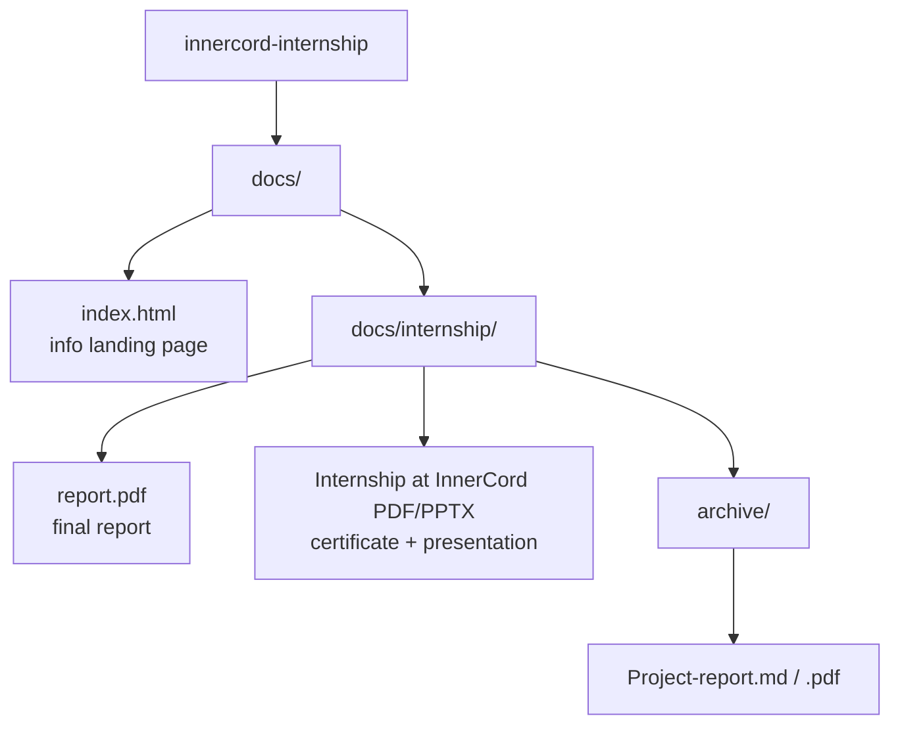

# InnerCord Internship Report

> Internship documentation and project report from InnerCord.

## What it is

A small documentation repository holding the internship report, certificate, presentation, and project report from an internship at **InnerCord**. It is an archive — the deliverables are collected here and published as a simple info page, not an active software project.

- **Live page:** https://innercord-internship.oriz.in
- **Repo:** https://github.com/chirag127/innercord-internship

> ⭐ If this is useful, please **star the repo**.

## Document structure

## Contents

| File | Description |
|------|-------------|
| `docs/internship/report.pdf` | Final internship report |
| `docs/internship/Internship at InnerCord (2).pdf` | Internship certificate / documentation |
| `docs/internship/Internship at InnerCord (3).pptx` | Presentation |
| `docs/internship/archive/Project-report.md` | Project report (Markdown) |
| `docs/internship/archive/Project-report.pdf` | Project report (PDF) |
| `docs/index.html` | Landing page |

## Quick start

This is a **documentation repo** — there is nothing to build or run. Either:

- Visit the published page: https://innercord-internship.oriz.in, or
- Browse the `docs/` folder directly.

The `ci.yml` workflow only runs `ruff` / `black` lint checks over any Python in the repo.

## Tech stack

- Static HTML (`docs/index.html`) served via **GitHub Pages** (custom domain).
- PDF / PPTX / Markdown documents.
- **GitHub Actions** (`ci.yml`) for lint checks.

## Part of the oriz family

One of the [oriz](https://blog.oriz.in) family of ~80 small, single-purpose sites. Static hosting runs at **$0 on the free tier**.

## Contributing

See [CONTRIBUTING.md](CONTRIBUTING.md). Security policy in [SECURITY.md](SECURITY.md).

## Status

Stable / archived — the internship is complete; this repo preserves its deliverables.

## Changelog

Conventional commits are the changelog.

## License

MIT — see [LICENSE](LICENSE).

## Author

Chirag Singhal · chirag@oriz.in
